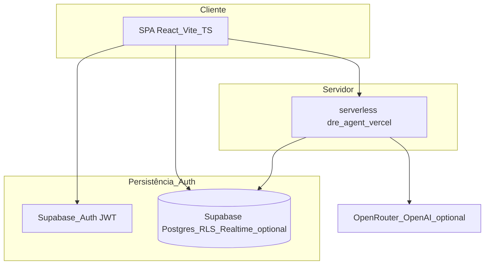

# PRD canónico — Portal gerencial DRE Febracis (`febracis-dre`)

**Documento:** requisitos de produto e arquitetura consolidados (fonte sintética do repositório).  
**Última consolidação:** 09/05/2026 BRT.  
**Não substitui:** operação ao vivo nem decisões só em controladoria — sempre cruzar com [`references/project-context.md`](../references/project-context.md) para deploy, URLs, políticas Supabase/Vercel e estado de produção.

---

## Índice

1. [Resumo executivo](#1-resumo-executivo)
2. [North star e tese](#2-north-star-e-tese-central)
3. [Personas papéis e escopo](#3-personas-papéis-e-escopo-rbac-narrativa)
4. [Fora do âmbito atual](#4-fora-do-âmbito-atual-explícito)
5. [Jornadas e fluxos canónicos](#5-jornadas-e-fluxos-canónicos)
6. [Requisitos por domínio](#6-requisitos-funcionais-por-domínio-do-produto)
7. [Modelo DRE motor e dados](#7-modelo-dre-motor-de-cálculo-e-alinhamento-à-planilha)
8. [Arquitetura de sistemas](#8-arquitetura-de-sistemas-estado-real-e-evolução-recomendada)
9. [Assistente DRE IA](#9-assistente-dre-ia-arquitetura-regras-e-roadmap-agente)
10. [Benchmark internacional norte](#10-benchmark-internacional-síntese-aplicável)
11. [Segurança e qualidade](#11-segurança-privacidade-e-qualidade-não-funcional)
12. [Fuso dados e competência BRT](#12-fuso-dados-e-competência-brt-produto)
13. [Roadmap em fases](#13-roadmap-estratégico-em-fases-consolidado)
14. [Critérios de aceite globais](#14-critérios-de-aceite-globais-consolidados)
15. [KPIs do produto](#15-kpis-de-produto-adoção-qualidade-eficiência-resultado)
16. [Riscos e mitigações](#16-riscos-e-mitigações)
17. [Mapa de documentos filhos](#17-mapa-de-documentos-filhos-anexo)

---

## 1. Resumo executivo

O **portal gerencial de resultado por franquia** organiza coleta padronizada da **DRE** das unidades, recalculo automático pelos KPIs Febracis (MC1, MC2, EBITDA 1, EBITDA 2) e **leitura executiva** por escopo (franquia, regional, holding, controladoria).  

**Decisões arquiteturais‑produto já arraigadas:**

- O **dashboard não é origem dos dados**: origem são **Submissões** + motor SQL + fluxo formal de revisão/controladoria.
- A **unidade preenche só linhas editáveis**; subtotais, margens e EBITDA são **somente sistema**.
- **IA (Assistente DRE)** orienta e propõe `fieldUpdates` nas linhas editáveis válidas → **motor oficial** mantém unicidade dos cálculos; o agente **não aprova**, **não recalcula fora da engine**, **não contorna RLS/workflow**.
- **Fonte operacional atual** está documentada endpoint a endpoint em **`references/project-context.md`** (GitHub/Vercel/Supabase, assistente `/app/assistant`, protocolo de fecho).

---

## 2. North star e tese central

| Elemento | Descrição |
|----------|-----------|
| **Visão curta** | Plataforma de **entrada assistida**, **cálculo auditável**, **benchmark** por unidade e **coaching** contextualizado — não “só mais um BI”. |
| **Resultado esperado** | Padronização da coleta, menos retrabalho, governança por papel/escopo, KPI oficial sempre calculado pelo sistema, trilhas de auditoria. |
| **Tese contra “spreadsheet paralelo”** | Coerência institucional: um único **modelo canónico da DRE** alinhável à **planilha de referência** com matriz planejada línea↔motor (ver §7). |

---

## 3. Personas, papéis e escopo (RBAC narrativa)

Síntese de [`docs/modelo-de-acesso-e-permissoes.md`](./modelo-de-acesso-e-permissoes.md) + realidade técnica (RLS + rotas SPA).

| Papel (`role`) | O quê faz | Escopo típico |
|----------------|-----------|----------------|
| **System admin** | Configura utilizadores; prepara/demo; maior latitud operacional | Rede conforme dados |
| **Finance controller** | Revisão oficial; único papel que pode devolver para `pending_adjustment` | Todas ou conforme dados |
| **Regional manager** | Compara carteira; **consulta submissões em leitura** | Só sua regional |
| **Franchise user** | Edita apenas na sua franquia; rascunho; enviar; modo leitura após travamento até devolução | Uma franquia |
| **Viewer** | Leitura | Conforme atribuição |

**Governança de travamento:**

- Estados editáveis pela unidade: `draft`, `reopened`, `pending_adjustment`.
- Bloqueados: `submitted`, `under_review`, `approved` — exceção operacional apenas devolução explícita da controladoria.

**Nota segurança:** papéis no React são UX; **`can_access_franchise`**, `is_admin`, `can_manage_review` em RLS + API são verdade técnica (ver §11).

---

## 4. Fora do âmbito atual (explícito)

- Substituir ERP contabilístico completo ou conciliação fiscal automática nacional.
- Aprovação legal de relatórios perante auditorias externas (o portal suporta **processo gerencial**, não substitui sign-off registado onde a empresa exija).
- **Serviço dedicado LangGraph/Python** recomendado no plano 2026-03-28: **opcional/arquitetura-alvo**, não infraestrutura imposta atual (hoje há `api/dre-agent.ts` serverless Vercel + Supabase).
- Vector buckets Supabase experimentais ou memory stores arquivadas sem validação produtiva (`langgraph-memory` arquivado — não baseline).

---

## 5. Jornadas e fluxos canónicos

Fluxo oficial (8 macro‑passos) — [`docs/visao-geral-do-sistema.md`](./visao-geral-do-sistema.md) + [`docs/logica-da-dre-e-do-workflow.md`](./logica-da-dre-e-do-workflow.md):

1. Franquia escolhe **competência** e tipo de fluxo (**eventos** onde aplicável).
2. Cria ou reaproveita **versão editável**.
3. Preenche **apenas linhas liberadas**, com opcional assistente + editor manual fallback.
4. Motor recalcula DRE/MC1/MC2/EBITDA 1 e 2.
5. Guarda **rascunhos** intermediários antes do envio.
6. Ao enviar (`submitted` / seguir workflow): **bloqueio de edição** pela franquia.
7. Controladoria **assume / revisa / aprova** ou devolve para `pending_adjustment`.
8. **Dashboard/consumos executivos** leem apenas saídas oficiais (ninguém consome “dado solto”).
9. Ciclo paralelo opcional Holding: filtros cockpit competência/regional/franquia com KPIs síncronos ao recorte [`docs/plano-dashboard...`](./plano-dashboard-executivo-e-agente-dre-2026-03-28.md).

Estado detalhe implementação cockpit + assistente está em [`docs/cockpit-executivo-e-assistente-dre-2026-03-28.md`](./cockpit-executivo-e-assistente-dre-2026-03-28.md) (com atualizações pontuais no `project-context`).

---

## 6. Requisitos funcionais por domínio do produto

### 6.1 Dashboard (`/app/dashboard`)

**Deve:**

- Mudar vista por papel: `franchise` \| `regional` \| `holding` \| `controladoria`.
- Para **holding/admin**: cockpit com KPIs rede, filtros **competência**, **regional**, **franquia**; ranking; fila revisão período selecionado; drill até submissão oficial quando roadmap/UI suportarem.
- Respeitar **headline escopo**, frescor de dados, grid executivo onde implementado (`ExecutiveKpiGrid`, etc.).
- **Competência holding:** quando filtro vazio e snapshot contém etiqueta **`YYYY‑MM`** do **mês civil BRT**, derivar período por defeito (ver §12).

**Não deve:** consumir rascunho arbitrário nem bypass de status sem regra declarada produto.

### 6.2 Submissões (`/app/submissions`)

**Deve:**

- Contexto período atual; estado da versão claro; cockpit três KPIs topo (desktop) coerentes com última decisão UX (progresso não duplicado no rail onde removido).
- Editor + preview sempre alinhados ao **mesmo estado** antes de gravar servidor.
- Abas/comportamentos mobile definidos conforme rollout (Painel \| DRE, sem dock de chat duplicando assistente completo onde retirado).
- Âncoras `?submission=` compartilháveis onde suportadas.

### 6.3 Assistente (`/app/assistant` + hub)

**Deve:**

- Modos **`duvidas` / produto tab** levando modo `explain_only` no servidor quando aplicável (`assistantProductTab`).
- Propagar apenas `fieldUpdates` validados contra catálogo **editável**.
- Persistir sessão/mensagens com RLS (migrations agente).
- Respeitar modo fallback determinístico sem chaves de provedor como path seguro degrade.

### 6.4 Workflow e revisão

- Estados: Draft → Submitted → Under review → Approved **ou** Pending adjustment ciclo até fecho.
- Nenhuma re‑abertura “silenciosa” sem transição registada/controlador.

### 6.5 Admin gestão usuários auditoria assistente

Rate limits assistente [`015_agent_rate_limits`], política **`audit_log` endurecida** (**016**) — especificação operacional no `project-context` e `.env.example` / Segredos Supabase (`ADMIN_PROVISION_ALLOWED_ORIGINS` para CORS admin provision Edge).

---

## 7. Modelo DRE, motor de cálculo e alinhamento à planilha

### 7.1 Cadeia de cálculo (canónico narrativo aplicativo)

Síntese [`docs/logica-da-dre-e-do-workflow.md`](./logica-da-dre-e-do-workflow.md):

- Deductions sobre RBV ⇒ **MC1**
- Despesas evento + variáveis + marketing + inadimplência ⇒ **MC2**
- Estrutura (pessoas, CTO, utilidades, despesas gerais) ⇒ **EBITDA 1**
- Impostos ⇒ **EBITDA 2**
- **MC1/MC2/EBITDA nunca entrada manual.**

### 7.2 Catálogo e glossário produto‑controladoria

Referência pedagógica + `line_code`: [`docs/dre-glossario.md`](./dre-glossario.md) (placeholder até curadoria humana final).

Matriz estrutura planilha × app: [`references/dre-modelo-gerencial-gap-matrix.md`](../references/dre-modelo-gerencial-gap-matrix.md).

### 7.3 Gaps conscientes versus planilha “Modelo DRE Gerencial”

Documentados na profundidade em [`docs/benchmark-internacional-e-plano-de-escala-2026-03-28.md`](./benchmark-internacional-e-plano-de-escala-2026-03-28.md) e **`dre-modelo-gerencial-gap-matrix`:**

- **Granularidade**: planilha abre várias linhas dentro de People/CTO/Utilities/Gerais; produto trabalhou com totais (`people_total`, etc.) até decisão estratégica de segunda fase.
- **Marketing / eventos**: possíveis deltas micro‑segmentação vs primeira versão base.
- **Dois mundos modelo mensal × evento**: obriga decisão explícita de **motor parametrizável** versus **templates** separados antes de benchmarks avançados.
- Correção foundational (Fase 0 no benchmark plan) antes de grande camada BI/IA NL.

Qualquer refactor motor exige regressão **`MC2`/EBITDA** com casos de teste aceites pela Controladoria (critérios §14).

---

## 8. Arquitetura de sistemas (estado real e evolução recomendada)

| Camada | Implementação atual (âncoras) | Alvo opcional recomendado (mar‑2026) |
|--------|-------------------------------|--------------------------------------|
| UI | SPA React 19 `/app/*`, TanStack Query | Consolidar workspaces sem duplicação estado |
| Orquestração IA | `api/dre-agent.ts`, validações Zod, rate limit | Serviço **Python + LangGraph** desacoplado via HTTP/SSE (memória + RAG + tool‑first); alternativa mono‑TS onboarding |
| Dados motor | Postgres functions/migrations calculation engine seed `dre_lines` | Formalizar **fonte verdade modelo** revisada controladoria |
| Vetoriais / KB | lexical assistant knowledge + espaço expansível | **pgvector** ou pipeline documental governado quando adotado |
| Deploy | **Vercel** produção produto + Edge Supabase onde aplicável | Manter SSO env + headers endurecidos onde roadmap Segurança |

---

## 9. Assistente DRE IA — arquitetura, regras e roadmap agente

### 9.1 Deveres e proibições (imutável negócio)

Do plano cockpit/mar‑2026 e auditorias:

| Dever | Proibição |
|-------|-----------|
| Fluxo perguntas/FAQs contextuais | Recalcular fora SQL motor |
| Explicar campos lingua simples | Aprovar submissões |
| Respeitar JWT + mesmo escopo leituras | Burlar políticas Postgres |
| `fieldUpdates` só editáveis + validação servidor | Persistir deltas em submissões travadas indevidas |
| Fallback custo‑zero modelo local | Prompt injection sem sanitização servidor |

Referências segurança e governança API: [`docs/security-review-2026-03-28.md`](./security-review-2026-03-28.md), [`references/audit-dre-agent-2026-05-08.md`](../references/audit-dre-agent-2026-05-08.md).

### 9.2 Padrões de produto primeira geração

Hybrid RAG, memória conversa thread, memória usuário/franquia com **namespace forte**, **tool‑first orchestration**, HITL onde impacto trabalho controlador.

### 9.3 Rollout IA (síntese 3 ondas original)

Ver §13 Fase cockpit + evoluções agent‑first.

---

## 10. Benchmark internacional — síntese aplicável

Síntese **Qvinci, ProfitKeeper, FranConnect, Fran Metrics, Naranga, ServiceMinder, Restaurant365** + QB/Xero de [`docs/benchmark-internacional-e-plano-de-escala-2026-03-28.md`](./benchmark-internacional-e-plano-de-escala-2026-03-28.md):

- **Standardização + scorecards** multimodelo ⇒ cockpit comparativo obrigatório na maturidade Produto Febracis.
- **Self‑service upload** ⇒ redução dependência suporte onboarding.
- **Single source truth contratual royalties** paralelo só narrativo ⇒ nosso paralelo é **motor DRE oficial**.
- **IA em LN** apenas após KPI base estáveis (Fran Metrics / IFA exemplo).
- **Rollout incremental treinável** ⇒ lotes piloto redes digitais + baixa tecnologia lado a lado.

Fontes lista longa ficam nas **URLs finais §fontes** documento benchmark original.

---

## 11. Segurança, privacidade e qualidade não funcional

Resumo **`security-review`** (28/03/2026 até evoluções posteriores no código):

**Boas‑práticas já:** JWT assistente usando identidade cliente Supabase anon + RLS, funções helper `security definer`, Zod servidor, sanitização texto + strip métricas, testes governance agente Vitest parte pipeline.

**Gaps conscientes registados:** CSP/headers SPA; CORS permissivo Edge admin provision ⇒ restringir `ADMIN_PROVISION_ALLOWED_ORIGINS` + política menos `*` onde possível; limite caracteres campo `message` API futuro opcional forte; refactor arquivos muito grandes (manutenibilidade == superfície risco inadvertida).

**Dependências:** manter **`npm audit` CI**/lock atualizado quando CI existir projeto.

Para **lista achados atualizada RBAC/UI** também ver [`references/audit-app-logic-2026-05-08.md`](../references/audit-app-logic-2026-05-08.md).

---

## 12. Fuso, dados e competência BRT (produto)

Politica atual consolidada Janeiro‑Maio 2026 espaço codebase:

| Tópico | Implementação canónica |
|--------|------------------------|
| Fuso formato datas UI | `America/Sao_Paulo` através `src/utils/brazilTimezone.ts` + utilitários formatter |
| Default competências submissões | `resolveDefaultReportingPeriod` − prioriza período **`open`**/**`reopened`** alinhando **mês civil BRT** onde possível [`src/utils/reportingPeriodResolve.ts`](../src/utils/reportingPeriodResolve.ts) |
| Holding cockpit período inicial | `holdingFiltersWithBrtDefault` memoria derivada filtros quando vazio existe data [`DashboardPage.tsx`](../src/features/dashboard/DashboardPage.tsx) |
| QA automático Vitest limites BRT | pasta `tests/unit/*brazil*` / `reporting-period-resolve` |

Detalhes adicionais = secção paralela já em **`references/project-context.md`**.

---

## 13. Roadmap estratégico em fases consolidado

| Fase | Nome trabalhando | Principais entregas chave |
|------|-----------------|----------------------------|
| **0** *(Benchmark doc)* **Foundations DRE modelo** | Alinhar planilha↔motor, casos regressão aceites Finance | fecha §7 gaps estruturais |
| **1** cockpit executivo segurança UX submissões | conforme rollout março já parcialmente entregues + filtros KPI comparação carteira RBAC parity | [`plano-dashboard...`](./plano-dashboard-executivo-e-agente-dre-2026-03-28.md) + cockpit doc |
| **2** menor friccao coleta guiada incremental | Fluxo guiado seções autosave realtime validações | benchmark Fase UX |
| **3** benchmarking scorecards coaching | KPI scorecards comparadores média/mediana/top quartile metas deltas | benchmarking Qvinci triplet |
| **4** rollout operacional centenas units | playbook lote centro ajuda contextual notifica papel auditoria granular linha importante | onboarding Naranga analogous |
| **5** IA explicativo avançado (pós‑base forte) | resumos auto comparativos coaching NL assistente perguntas abertas desempenho | Restaurant365 analogous FRAN‑AI analogous |

Critérios de saída fase modelo planilha: **paridade métricas controladas**.

---

## 14. Critérios de aceite globais consolidados

1. **`admin/holding`** vê rede com filtros competência/regional/franquia (estado atual cockpit documentado projeto).
2. **`regional_manager`** apenas carteira, filtros coherentes papel.
3. **`franchise_user`** apenas sua unidade, impossibilitado edit fora drafts/reopened/adjust flows.
4. **Agente não quebra** workflow nem faz cálculo paralelo aos fatos engine.
5. **Respostas com base auditável** (documentação/glossário/controlador quando RAG oficial).
6. **Edição menos fragmentada perceptível pelo franqueado** segundo métricas usabilidade (tempo ciclo primeira submissão).
7. **Dashboard não consome drafts soltos**.
8. **Datas prazos e competências** coerentes calendário **BRT** em browsers fora TZ Brasil (§12 smoke manual homologável).
9. **Segurança**: RLS sempre prova regressão antes release assistente grandes mudanças.
10. **Motor DRE cada release material** regressão automatizada aumentar cobertura `MC2`/margens deltas > limiar controlador quando definido quantitativamente.

---

## 15. KPIs de produto (adoção / qualidade / eficiência / resultado)

Lista original benchmark adaptada aplicável dashboards internos Produto Ops:

**Adoção:** franquias ativas período • tempo primeira submissão • % drafts → submitted.

**Qualidade:** devoluções ajuste • média validações bloqueantes divergências preview servidor.

**Eficiência:** tempo médio preenchimento unidade • tempo ciclo revisão controlador • tickets suporte por 100 franquias.

**Resultados:** SLA fechamento competência • cobertura aprovadas • redução rework ciclo ciclo ciclo longitudinal.

---

## 16. Riscos e mitigações

| Risco | Mitigação |
|-------|-----------|
| Modelo dados ≠ planilha | Fase Foundations + regressão aceite escritas signed Controlador |
| Prompt injection custo modelo | sanitização servidor + modo explain‑only obrig where necessary + métricas OpenRouter budgets |
| Chaves modelo no cliente | somente servidor `api/` |
| Fragilidade arquivos monolitos Submissions/Assistant | refactor modularização planejado com testes comportamentais preservados |
| Suposições benchmark internacional extrapol BR | sempre validação local IFB/contexto franchises Brasil |
| **Dependência TZ browser** já mitigado | §12 infra utilitários — manter suites temporizadas DST Brazil |

---

## 17. Mapa de documentos filhos (anexo)

Consultar estes quando detalhar além nível estratégico PRD único:

| Documento relativo repo | Finalidade curta |
|-------------------------|-------------------|
| `docs/visao-geral-do-sistema.md` | visão inicial camadas guardian rails |
| `docs/plano-dashboard-executivo-e-agente-dre-2026-03-28.md` | plano cockpit + roadmap agent primeiro |
| `docs/cockpit-executivo-e-assistente-dre-2026-03-28.md` | fatos rollout mar‑2026 + paths implementação arquivo |
| `docs/logica-da-dre-e-do-workflow.md` | fórmulas motor alto nível + estados |
| `docs/dre-glossario.md` | line_code copy legal pedagógica |
| `docs/modelo-de-acesso-e-permissoes.md` | texto perfis papel negócio |
| `docs/benchmark-internacional-e-plano-de-escala-2026-03-28.md` | externo+preenchível profundo |
| `docs/security-review-2026-03-28.md` | segurança arquitetural |
| `references/project-context.md` | **fonte verdade operações deploy assistente BRT** atualizações constantes obrig agentes IA |
| `references/dre-modelo-gerencial-gap-matrix.md` | mapeação planilha |
| `references/audit-app-logic-2026-05-08.md` / `references/audit-dre-agent-2026-05-08.md` | auditorias abril‑maio 2026 estado lógicas produto/agent |

---

**Fim PRD canónico** — atualizar esta consolidação quando decisões estratégicas mudarem modelo negócio, motor contábil ou papel agente infra.
