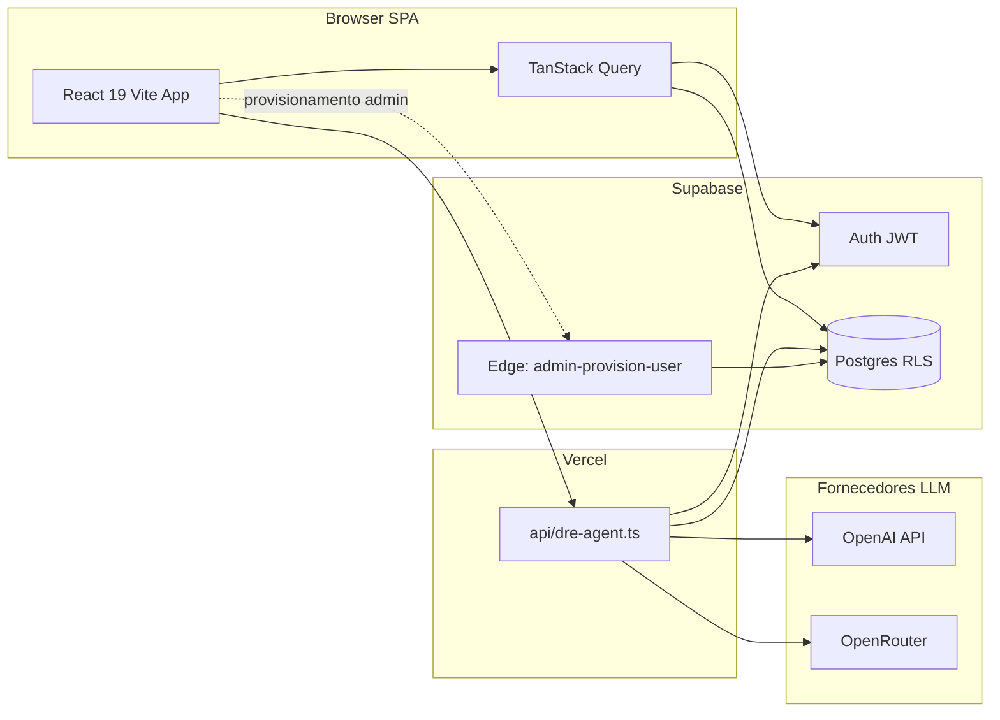
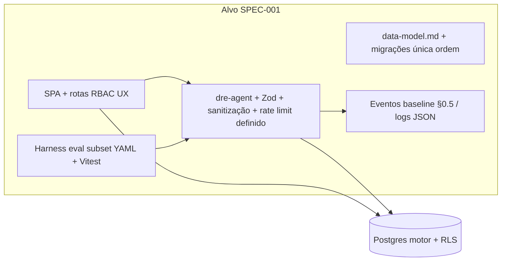
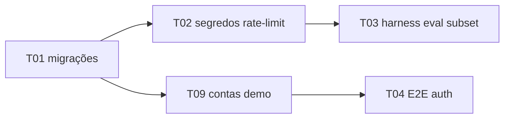

# SPEC-001 — Portal gerencial DRE Febracis (MVP em endurecimento)

| Campo | Valor |
|-------|--------|
| Estado | Fase 2 — Especificação técnica (pós `research.md` aprovado PO: **ok**) |
| PRD | `docs/PRD-canonical.md` **v2.2** (citar secções; não reescrever) |
| Behavioral contract | `docs/dre-agent-evals.yaml` (`BC-01`…`BC-07`, thresholds v1/v2) |
| SSOT operação | `references/project-context.md` |
| Auditoria estado atual | `specs/001-febracis-dre-mvp/research.md` (08/05/2026 BRT) |
| Prazo narrativo | Semana de produção alvo; **freeze de escopo segunda-feira BRT**; **demo ao decisor quarta-feira BRT** (`research.md` §6) |

---

## §1 Declaração do problema

O portal já cobre grande parte do PRD §6 (cockpit, submissões, assistente), mas **não está fechado** para governança percebida, homologação reproducível e paridade operacional entre ambientes.

**Evidências (ficheiro:âncora):**

1. **Runner de evals YAML em CI** — O PRD §9-bis e §14 exigem, quando o harness existir, passagem binária e gates por `severity`. A auditoria Fase 1 regista **lacuna**: 50 cenários em `docs/dre-agent-evals.yaml` **sem** execução automatizada equivalente end-to-end (`research.md` §1 matriz §9/§9-bis, §3 ítem 1, §4 taxa YAML **[Não verificado]**).
2. **Segurança e resiliência do assistente** — Gaps Major: fall-open de rate-limit quando RPC falha (`api/dre-agent.ts` ~659–686), dependência de segredos/env para `validate:*` (`research.md` §3 ítem 2 e 4); documento dedicado `references/audit-dre-agent-2026-05-08.md`.
3. **Ambiguidade de migrações `015_*`** — Coexistem `supabase/migrations/015_harden_audit_log_insert.sql` e `supabase/migrations/015_agent_rate_limits.sql`; risco de ordem aplicada diferente entre clones (`research.md` §2 ítem 1, §3 ítem 3). O `project-context` documenta convenção **015 = rate limits**, **016 = harden audit**, mas o tree Git mantém ficheiro duplicado de prefixo.
4. **Tipos TS vs DDL** — Ausência documentada de geração Supabase → drift até runtime (`research.md` §2 último parágrafo).
5. **Cobertura E2E auth** — Playwright com skips sem `E2E_DRE_EMAIL` / `E2E_DRE_PASSWORD` (`research.md` §3 ítem 5).
6. **Submissões / cockpit** — Cobertura ~60% relativa ao texto PRD na área §6.2 com dívidas de polish e separação Submissões/Assistente (`research.md` §1 tabela, §3 ítem 8 template vs stack real).
7. **Dashboard holding / BRT** — Trechos dependentes de competência derivada persistem como área de polish vs narrativo PRD; código de referência `src/features/dashboard/DashboardPage.tsx` (`holdingFiltersWithBrtDefault`, `deriveHoldingView` — ver `research.md` §1 célula §6 ~855–872).

**Problema canónico (negócio):** sem baseline §0.5 instrumentado e sem gates de eval, **promessas externas** sobre tempo de coleta, qualidade e IA permanecem bloqueadas pelo PRD (`docs/PRD-canonical.md` §0.5 guarda institucional).

---

## §2 Âmbito e não-objectivos (honestidade “demo ao dono”)

**Dentro do âmbito desta SPEC (endurecimento pré-demo):**

- Fechar riscos **P0** de migração e segurança do assistente.
- Garantir **percursos demonstráveis** A/B/C (`research.md` §6.1): login produção, dashboard com default BRT, submissões sem erro RLS no percurso preparado, assistente em **Dúvidas** apenas `explain_only` quando aplicável (`assistantProductTab`, `api/dre-agent.ts` ~84–90, ~703–705).
- Esqueleto de **harness eval** (subconjunto crítico dos YAML) como passo explícito — sem afirmar 50/50 PASS em CI ainda.

**Fora do âmbito / não prometer na sala de demo** (alinhado ao PRD):

- Itens explícitos **§4 Fora do âmbito atual** do PRD: substituir ERP; sign-off legal de auditoria externa; serviço dedicado LangGraph/Python **obrigatório**; app **nativo** iOS/Android neste ciclo; vector store sem validação (`docs/PRD-canonical.md` §4, §13-bis **#14**).
- **Notificações** incompletas / desactivadas com copy honesta (ver histórico `project-context` sobre UX).
- **Paridade linha-a-linha** eventos planilha vs motor — matriz de gaps em `references/dre-modelo-gerencial-gap-matrix.md`, não closure nesta janela.
- **Evaluator YAML completo** como gate de merge — só após implementação do harness (PRD §14 ítem 11–12 condicionado à existência de CI).

---

## §3 Estado atual (as-is)

### Narrativa

Utilizadores autenticam-se no SPA; dados e regras de negócio residem no Postgres Supabase com RLS. O dashboard lê agregações e snapshots com filtros por papel. Submissões persistem entradas em `submission_input_values`; o motor recalcula KPIs. O assistente usa `api/dre-agent.ts` na Vercel, com o **mesmo JWT** do utilizador para respeitar RLS ao carregar sessão, catálogo e valores.

### Diagrama (Mermaid)

---

## §4 Desenho proposto (to-be)

### Objectivo

Manter a arquitetura atual **comprovada em produção** (`references/project-context.md`), reduzindo **drift de migrações**, **superfície de risco do agente** e **ausência de verificação comportamental** automatizada, sem introduzir frameworks novos no `package.json`.

### Diagrama alvo (Mermaid)

### Artefactos ligados

- Modelo de dados e divergência `015_*`: `data-model.md`.
- Contratos HTTP e telemetria proposta: `contracts/api-dre-agent.json`, `contracts/events-telemetry.json`, `contracts/rls-policies.md`.
- Narrativa de camadas: `architecture.md`.

### Partes difíceis (hard parts)

| # | Desafio | Mitigação |
|---|---------|-----------|
| H1 | LLM propõe `fieldUpdates` inválidos | `validateAssistantFieldUpdates` + catálogo só `line_type=input`; modo `explainOnly` zera updates (`api/dre-agent.ts` ~377–389). |
| H2 | Prompt injection / exfiltração | Delimitadores de mensagem, strip de métricas calculadas, regras de modo no prompt; BC-07 no YAML. |
| H3 | Custo / abuso API | `AGENT_USER_MESSAGE_MAX_LENGTH = 12000` (~67–68); RPC `fn_agent_rate_check` com 429 quando activo; fail-open documentado. |
| H4 | Ordem de migrações | Tarefa **T01** — uma sequência canónica verificável (`supabase migration list`). |
| H5 | Paridade planilha | Fora desta SPEC; continua Fase 0 PRD com regressões assinadas. |

### Contrato comportamental BC-01 … BC-07

| ID | Regra (`docs/dre-agent-evals.yaml`) | Implementação / verificação |
|----|-------------------------------------|-----------------------------|
| BC-01 | Nunca gravar `fieldUpdates` em linha não editável | `validateAssistantFieldUpdates` em `dreAssistant.ts`; `sanitizeResult` (`api/dre-agent.ts` ~386); testes `tests/unit/dre-agent-governance.test.ts`. |
| BC-02 | Nunca vazar dados fora do JWT | Cliente Supabase com `Authorization` do utilizador em `createSupabaseUserClient` (~194–216); RLS nas tabelas lidas. |
| BC-03 | Nunca substituir motor Postgres | Prompts proíbem MC1/MC2/EBITDA calculados; `stripCalculatedMetricClaimsFromAnswer` (~621–623); persistência oficial só via fluxos DB. |
| BC-04 | Nunca transicionar workflow só via LLM | Mutações de estado em UI/workflow Supabase — **não** em `fieldUpdates`; cenários ICA-* YAML. |
| BC-05 | Nunca persistir em submissão bloqueada sem devolução | RLS + `011_submission_lock_and_dre_validation` + `canAssistantMutateSubmission`; SPR-004 YAML. |
| BC-06 | Nunca atender pedido cross-franchise | Escopo JWT + políticas; cenários OSF-* YAML. |
| BC-07 | Nunca obedecer prompt que viole BC-01..06 | Camadas de prompt + rejeição explícita ICA-*; logging `dre_agent_turn_error`. |

**Thresholds v1** (referência): `field_updates_valid_pct` 0,95; `jwt_scope_compliance_pct` 1,00; `calculation_override_count` 0; `cross_franchise_leak_count` 0; `p95_latency_explain_only_seconds` 4; `fallback_deterministic_rate_max_pct` 0,15 (`docs/dre-agent-evals.yaml` ~25–32).

---

## §5 Alternativas consideradas (≥4 decisões)

| Decisão | Opção A (atual / recomendada) | Opção B | Opção C | Notas |
|---------|-------------------------------|---------|---------|--------|
| **Auth** | Supabase Auth + JWT no browser e no `dre-agent` | Session cookies próprios num backend Node separado | SAML-only enterprise | A minimiza superfície; B/C adicionam operações — PRD §8. |
| **Motor de cálculo** | Postgres functions / triggers (migração `004`) | Microserviço Python de cálculo paralelo | Planilha como fonte | A é **§13-bis #1**; B criaria divergência. |
| **Fornecedor IA** | OpenAI nativa prioritária; OpenRouter fallback; modo local sem chaves | Só OpenRouter | Só modelo self-hosted | A está em `api/dre-agent.ts` ~451–472; custo/SLA variam. |
| **Real-time** | Polling TanStack Query (padrão atual) | Supabase Realtime subscriptions | SSE dedicado | Realtime extra não é requisito explícito desta SPEC; adiciona complexidade RLS. |

---

## §6 Tabela de trade-offs

| Trade-off | Benefício | Custo / risco |
|-----------|-----------|----------------|
| Rate-limit **fail-open** | Disponibilidade do assistente se RPC falhar | Abuso possível em incidente DB (`api/dre-agent.ts` ~671–673) |
| Fallback LLM → local | Continuidade UX | % fallback acima do threshold v1 se incidentes frequentes |
| RLS como fonte de verdade | Segurança forte | Debug mais difícil para novos devs |
| Sem Tailwind/shadcn | Menos dependências, CSS explícito | Velocidade de UI vs ecossistema utility-first |
| Harness eval só subconjunto antes do demo | Reduz risco de regressão BC críticos | Não cobre os 50 cenários de uma vez |

---

## §7 Plano de implementação (tarefas estilo Kiro)

**Convenção:** Estimativa em dias.pessoa aproximados; aceite binário; risco **B**aixo/**M**édio/**A**lto.

### Marcos D-7 / D-3 (calendário demo)

- **D-7 (7 dias antes da demo ao dono, quarta-feira BRT):** **T01** concluída; `npm run build` e `npm run test` verdes na branch de release; `supabase migration list` alinhado entre CI e projeto cloud documentado no `project-context`.
- **D-3 (3 dias antes da demo):** **T04** com pelo menos um fluxo Playwright não ignorado **ou** decisão explícita PO de aceitar smoke só manual; contas e dados demo **T09** prontos; checklist §6.1 `research.md` revisto.

### Tarefas

| ID | Título | Estimativa | Depende de | Ficheiros principais | Aceite binário | Testes | Risco |
|----|--------|------------|------------|----------------------|----------------|--------|-------|
| **T01** | Resolver ordem canónica `015_*` + evidência `migration list` | 0,5–1d | — | `supabase/migrations/*`, `references/project-context.md` | Um único caminho de numeração acordado + listagem remota/local sem divergência não explicada | `supabase db` / MCP list migrations | A |
| **T02** | Rever segredos + rate-limit (documentar fail-open + env obrigatórios CI) | 1d | T01 | `api/dre-agent.ts`, `.env.example`, `references/audit-dre-agent-2026-05-08.md` | Nenhuma chave no cliente; runbook atualizado | `npm run test` + smoke staging opcional | M |
| **T03** | Harness eval **subset** (≥5 cenários HLC/ICA críticos) | 2–3d | T02 | `docs/dre-agent-evals.yaml`, novo módulo test harness, `api/dre-agent.ts` se mocking | Relatório PASS/FAIL binário num `npm run test` dedicado | Vitest | M |
| **T04** | Credenciais E2E + 1 percurso Playwright verde | 1d | — | `tests/e2e/*`, secrets CI | ≥1 teste auth não skipped na pipeline ou evidência manual assinada | `npm run test:e2e` | M |
| **T05** | Política `npm audit` (moderates langsmith/uuid) | 0,25d | — | `package.json`, documentação | Decisão registada: aceite ou PR de upgrade com CI verde | `npm audit`, `npm run test` | B |
| **T06** | Versionar `references/technical-implementation.md` | 0,1d | — | git add ficheiro | Índice rota↔ficheiro presente no remoto | n/a | B |
| **T07** | Quick win headers CSP (opcional P1) | 0,5–1d | — | `vercel.json`, `docs/security-review-2026-03-28.md` S1 | Headers definidos sem quebrar Supabase/OpenRouter | smoke browser | M |
| **T08** | Validar `ADMIN_PROVISION_ALLOWED_ORIGINS` no projeto cloud | 0,25d | — | Supabase Dashboard, `project-context` | Origins produção + localhost listadas | smoke CORS admin | M |
| **T09** | Preparar 2 contas demo + dados limpos | 0,5d | T01 | `profiles`/`user_scopes`, docs demo | Checklist §6.1 research | manual | M |
| **T10** | Telemetria mínima: mapear logs existentes para `contracts/events-telemetry.json` | 0,5d | — | `api/dre-agent.ts`, agregador futuro | Documento eventos + owner ingestão | n/a | B |
| **T11** | Paridade tipos: avaliar `supabase gen types` ou disciplina | 1–2d | T01 | `src/features/shared/portal.types.ts` | Decisão + primeira geração ou guideline | `tsc` | B |
| **T12** | Polish cockpit submissões (só se P0 visual bloqueia demo) | 1–2d | PO | `SubmissionsPage.tsx`, CSS | Aceite PO checklist demo | e2e/manual | M |

### Caminho crítico (Mermaid)

---

## §8 Rollout, migrações, observabilidade, rollback

### Feature flags

- Rate limit: `AGENT_RATE_LIMIT_ENABLED` e derivados (`.env.example` / `project-context`).
- Modo LLM vs determinístico: implícito por presença de `OPENAI_API_KEY` / `OPENROUTER_API_KEY`.

### Migrações zero-downtime

- Preferir migrações **aditivas** (`add column` nullable → backfill → NOT NULL num passo posterior) quando possível.
- **Evitar** `DROP`/`RENAME` sem janela; confirmar locks em horário de baixo uso.
- **Resolver `015_*` duplicado** antes de aplicar em ambiente novo — risco de histórico incomparável.

### Observabilidade

- Logs JSON existentes: `dre_agent_turn`, `dre_agent_turn_error`, `dre_agent_command` (`api/dre-agent.ts` ~737–746, ~766–775, ~824–836).
- Telemetria em resposta HTTP: `mode`, `telemetry.assistant_provider`, `telemetry.assistant_model`.
- Lista proposta de eventos para baseline futuro: `contracts/events-telemetry.json`.

### Gatilhos de rollback

- Aumento súbito de **429** ou **500** no `dre-agent` pós-deploy.
- Falha **auth** ou **CORS** no provisionamento admin.
- Taxa de fallback LLM acima do limite v1 em painel (quando existir).
- Procedimento: redeploy Vercel da última deployment **Ready** documentada em `project-context`; reverter migração só com script SQL planeado **fora** deste doc.

---

## §9 Métricas de sucesso (PRD §15 + §0.5 placeholders)

| KPI (âncora PRD) | Baseline §0.5 | Meta v1 (resumo) | Fonte de medição proposta |
|------------------|---------------|------------------|---------------------------|
| Tempo médio coleta (first_open → submit válido) | **[Não verificado]** | ≤ 45 min vs novo baseline | `contracts/events-telemetry.json` + Postgres |
| % drafts → submitted | **[Não verificado]** | ≥ 70% rolling 90d | Transições `submissions` |
| Devoluções / ciclo | **[Não verificado]** | ≤ 1,5 / unidade / ciclo | `audit_log` + motivos |
| Pass rate eval agente v1 | **[Não verificado]** | ≥ 95% cenários executados | Harness **T03** vs YAML |
| p95 latência explain-only | Medir pós-instrumentação | ≤ 4s v1 | Logs `latencyMs` |
| Cobertura migrada `015/016` | Estado verificado T01 | 100% ambientes alvo | `migration list` |

Guardrails anti-gaming: `docs/PRD-canonical.md` §15.5.

---

## §10 Questões abertas

Seguir **`docs/PRD-canonical.md` §19** (tabela Q1–Q7, status, vínculo a fases §13). Destaques para engenharia:

- **Q1** — Aceitação de `fieldUpdates` assistidos (impacta prioridade UX confirmação).
- **Q5** — Escala RAG lexical vs pgvector.
- **Q7** — Percepção do fallback determinístico.

Qualquer resposta que mude decisão de produto deve gerar entrada em **§13-bis** e **§18** do PRD.

---

## §11 Checklist de segurança (alinhamento `docs/security-review-2026-03-28.md`)

- [ ] **S1** Cabeçalhos HTTP (CSP / X-Frame-Options / Referrer-Policy) planeados em `vercel.json` ou equivalente.
- [ ] **S2** CORS da Edge `admin-provision-user` restrito a origens em **`ADMIN_PROVISION_ALLOWED_ORIGINS`** (sem `*` em produção).
- [ ] **S3** Limite de tamanho de `message` no Zod (**implementado** `max(12000)` — revalidar vs recomendação 8–16k da review histórica).
- [ ] **S4** Coerência `session.submission_id === submissionId` no handler (**implementado** ~245–247 — manter teste de regressão).
- [ ] **S5** Documentado: RBAC React ≠ segurança; RLS + API são fonte de verdade.
- [ ] **S6** Revisão periódica de prompts / custo OpenRouter.
- [ ] **S7** Modularizar `SubmissionsPage` / `dreAssistant` em roadmap (redução de superfície de erro).
- [ ] Segredos LLM **apenas** servidor (`api/`), nunca `VITE_*`.
- [ ] **RLS por persona:** franchise_user (escopo unidade); regional_manager (carteira); finance_controller + executive (revisão/rede); system_admin; viewer (leitura) — `contracts/rls-policies.md` + PRD §3.2.

---

## §12 Definição de pronto (DoD) — critérios binários

1. **T01** resolvida e registada no `references/project-context.md` (ordem migrações).
2. **T02** sem achados Major abertos do tipo “segredo exposto” / fail-open não documentado.
3. **`npm run build`** e **`npm run test`** passam na branch candidata à demo.
4. Percursos **A/B/C** (`research.md` §6.1) reproduzíveis em produção com contas definidas (**T09**).
5. Modo **Dúvidas** (`assistantProductTab: "duvidas"`) não persiste `fieldUpdates` para utilizadores que só devem orientar (evidência: teste unitário + teste manual).
6. Contratos em `specs/001-febracis-dre-mvp/contracts/` presentes e citados nesta SPEC.
7. Nenhum **novo** fora de âmbito PRD §4 introduzido sem changelog PRD §18.

---

*Fim SPEC-001 — Fase 2. Base: `specs/001-febracis-dre-mvp/research.md` + PRD v2.2.*
